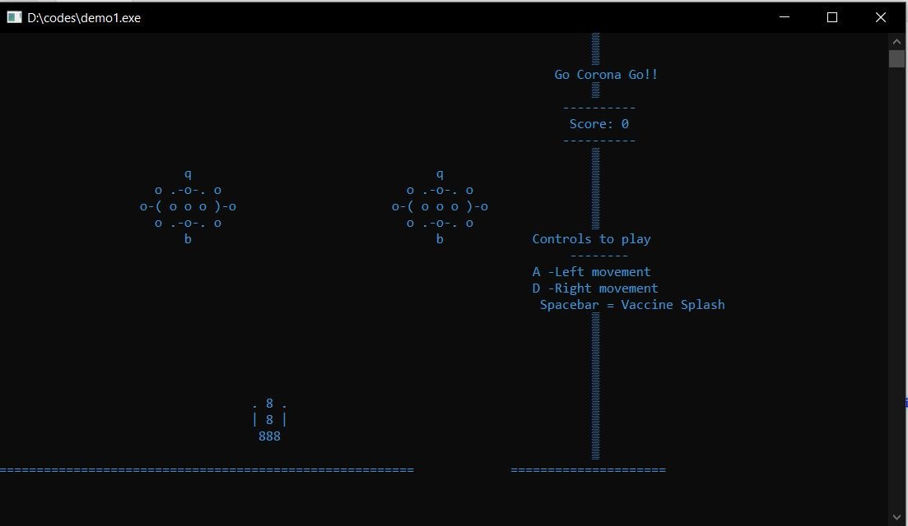
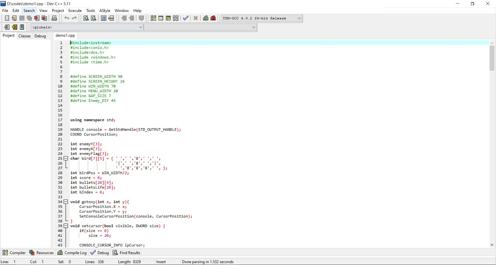
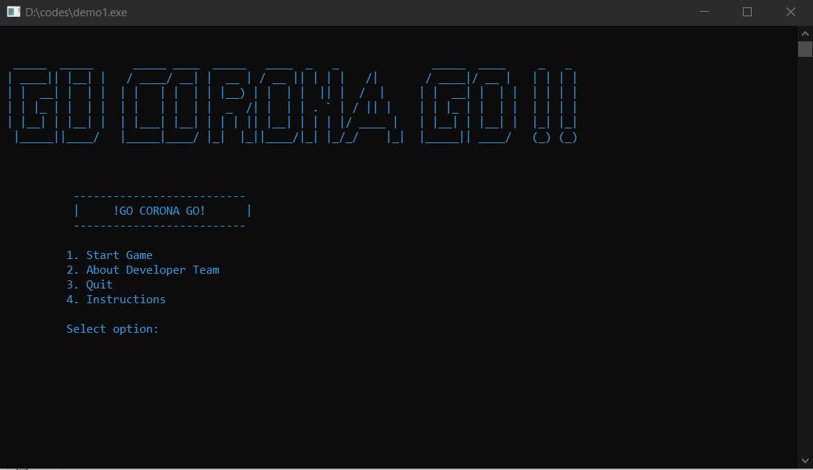
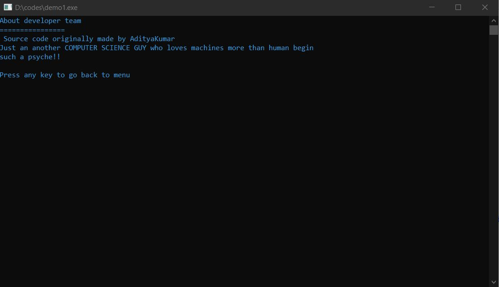
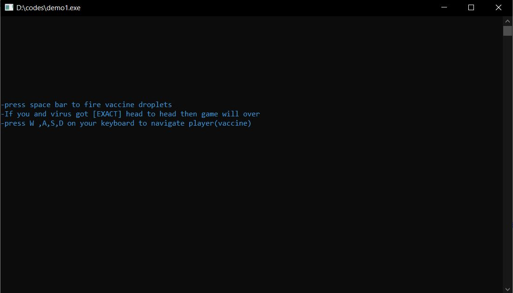
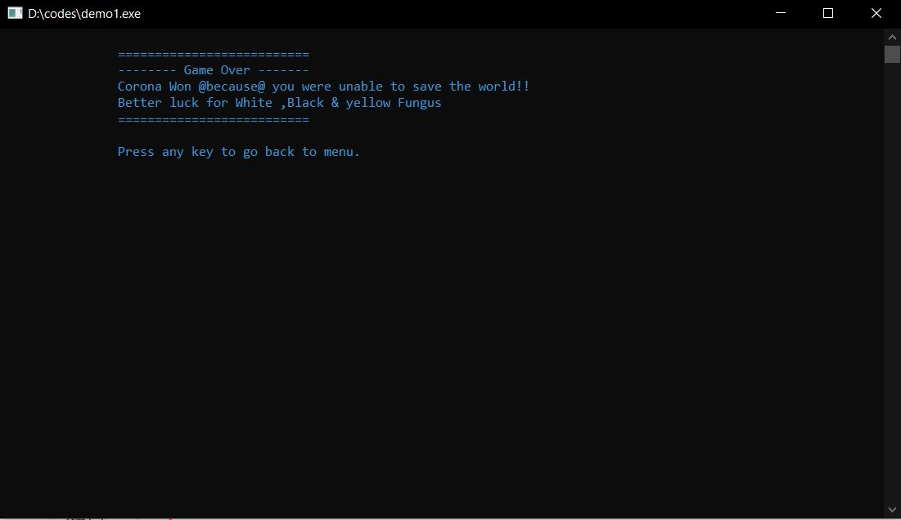

# GO-CORONA-GO----Terminal-Based-Game
This a CLI based game written in C++ lang , using DEVC++ IDE , you need to complie and run in DEV C++ , which will ultimately pop up a CLI interface to play this game. So lets begin a war against COVID :))

<h1>GAMEPLAY</h1>

### ---->>OVERVIEW OF CODE IN IDE

### ---->>MAIN MENU

### ---->>ABOUT DEV

### ---->>INSTRUCTION WINDOW

### ---->>GAME OVER WINDOW

### ---->>OVERVIEW OF CODE IN IDE

